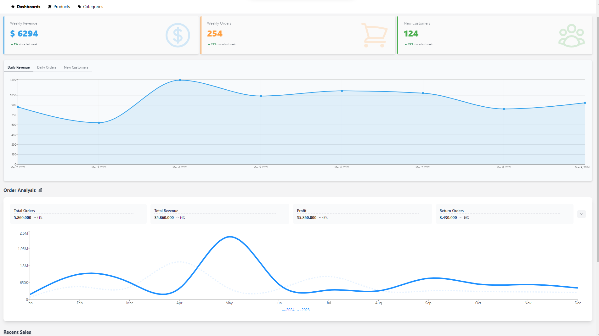

# Final UI

## Main Screen
<p> I have integrated this feature in main page only inside Dashboard Component.


## Loading Screen

<div align="center" style="margin: 30px;">

.png>)
<br />
<br />

## Collapsed Screen


<br />
<br />

## Main Screen


<br/>
<br/>

## Overlay


</div>

<br />

<br />
<br />

## Run Application 

First of all download / clone the project:


Once cloning is complete, navigate to the project folder and run this command:

```
npm i
```

after that  run this command:

```
npm run dev
```

Your will see application running at  http://localhost:5173


